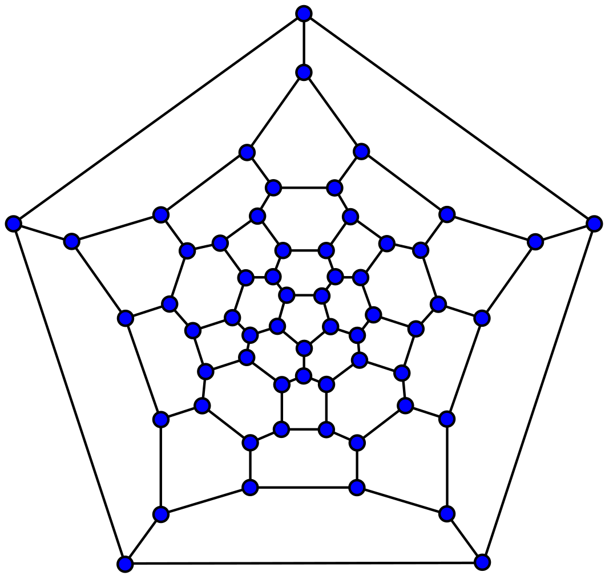

# Planarity Knot

[Planarity Knot live][planarity-knot]

[planarity-knot]: https://nkhem.github.io/planarity-knot/

Planarity Knot is a mathematical puzzle based on a popular online computer game, Planarity, which was conceived by Mary Radcliffe and built by John Tantalo in 2005. Planarity Knot is built entirely in vanilla JavaScript, HTML, and CSS.

In graph theory, a planar graph is one whose lines intersect only at their endpoints.

The goal of the game is to create a planar graph by rearranging the endpoints so that none of the lines cross.
